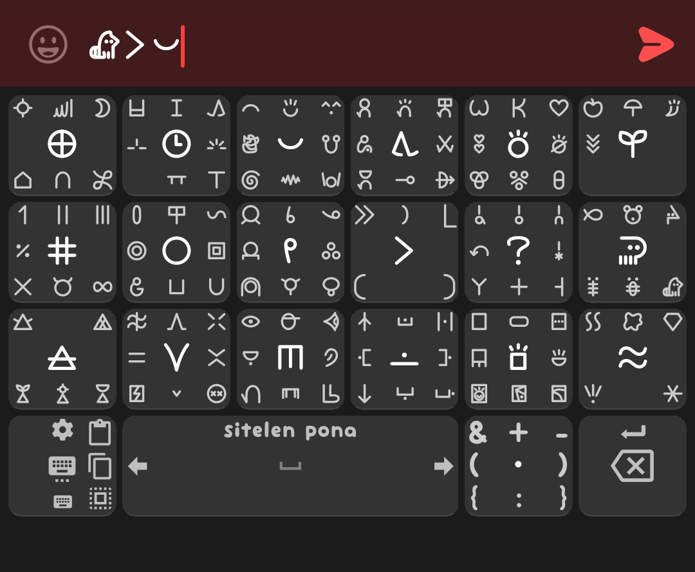

# sitelen pona (nasin nanpa UCSUR)

tested on [Unexpected Keyboard 1.30.3](https://github.com/Julow/Unexpected-Keyboard/releases/tag/1.30.3) with [nasin nanpa 4.0.2](https://github.com/etbcor/nasin-nanpa/releases/tag/n4.0.2)

6x4 sitelen pona keyboard whith groups of 5-9 glyphs in each

features:
- basic toki pona words with some additions, sorted into groups
- [invisible characters](https://github.com/etbcor/nasin-nanpa?tab=readme-ov-file#ligatures) & + - ( ) { }
- brackets for nimi
- scrollable spacebar
- select, copy and paste buttons

note: pi uses long underline glyph so it should to be closed by ) to stop underline

[layout xml](sitelen-pona-nasin-nanpa-ucsur.xml)

