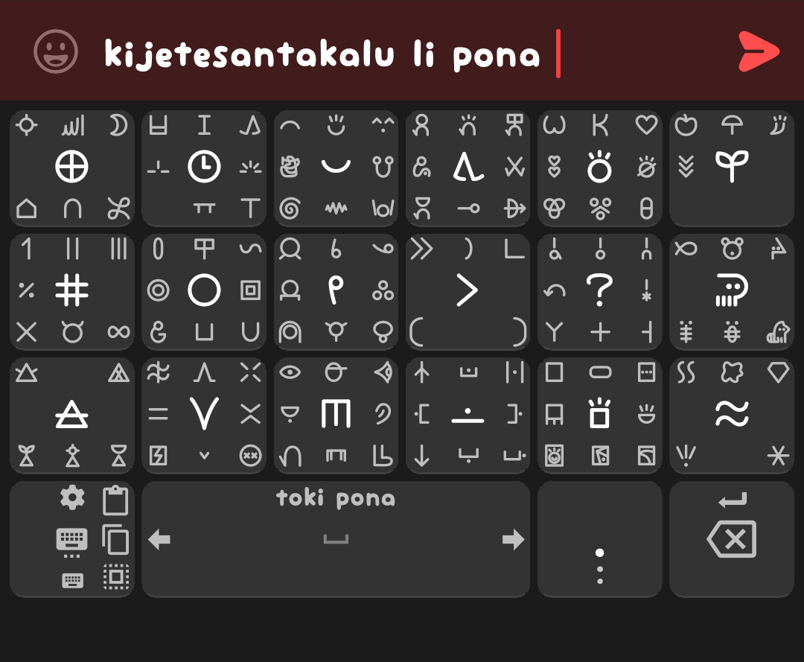

|toki pona (with sitelen pona buttons)|sitelen pona (nasin nanpa UCSUR)|
|-|-|
|tested on [Unexpected Keyboard 1.30.3](https://github.com/Julow/Unexpected-Keyboard/releases/tag/1.30.3) with [nasin nanpa 4.0.2](https://github.com/etbcor/nasin-nanpa/releases/tag/n4.0.2)  6x4 sitelen pona keyboard whith groups of 5-9 glyphs in each  features: - basic toki pona words with some additions, sorted into groups - scrollable spacebar - select, copy and paste buttons  [layout xml](sitelen-toki-pona.xml)  |tested on [Unexpected Keyboard 1.30.3](https://github.com/Julow/Unexpected-Keyboard/releases/tag/1.30.3) with [nasin nanpa 4.0.2](https://github.com/etbcor/nasin-nanpa/releases/tag/n4.0.2)  6x4 sitelen pona keyboard whith groups of 5-9 glyphs in each  features: - basic toki pona words with some additions, sorted into groups - [invisible characters](https://github.com/etbcor/nasin-nanpa?tab=readme-ov-file#ligatures) & + - ( ) { } - brackets for nimi - scrollable spacebar - select, copy and paste buttons  note: pi uses long underline glyph so it should to be closed by ) to stop underline  [layout xml](sitelen-pona-nasin-nanpa-ucsur.xml)   |
